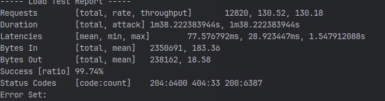

В базе находятся 64 уникальных 
продукта (48 тестовых), в некоторой степени это даже избыточно для корзины, 
так как люди не добавляют разом столько продуктов, но для нагрузочного тестирования стоит проверить

Для тестирования создания, выбрана как основная сущность заказов, 
для создания заказа нужно добавить сначала в корзину.

При успешном добавлении в корзину выходит статус 204, при успешной покупке статус 200.

Ручки:
```yaml
    add_to_cart: "/api/v1/cart/product/{id}"
    make_order: "/api/v1/orders"
```

Для возможности воссоздать тест, и повторить нужно получить session-id и csrf-token


# Начало тестирования
___


## На сервере
Начали на машине предоставленной (для тестирования нужно поменять domain)

Запустили тест и получили ~10к rpm, при увеличении машинка упала, и продолжили уже локально.




## Локально
Запускаем тестирование, попробую поиграться с параметрами


### Тест -- итерация 1

```
Starting Load Test with 10 users, 100 concurrency, 5 iterations and 1000 RPS
----- Load Test Report -----
Requests        [total, rate, throughput]       1620, 3791.87, 3555.46
Duration        [total, attack] 427.229757ms, 427.229757ms
Latencies       [mean, min, max]        25.43689ms, 363.528µs, 150.525669ms
Bytes In        [total, mean]   424040, 261.75
Bytes Out       [total, mean]   30962, 19.11
Success [ratio] 93.77%
Status Codes    [code:count]    404:101 200:719 204:800
Error Set:
unexpected status code 404 when creating order   msg: {"status":404,"body":{"error_message":"Корзина пуста"}}

----------------------------
```

93.8% успешных запросов, 101 запрос из 1620 выдал ошибку, что корзина пустая,
скорее всего это из-за гонки, думаю что это из-за малого количества пользователей, ведь
при покупке вся корзина опустошается, решаю поднять количество пользователей.

Сервер выдал 3857rps.


### Тест -- итерация 2

```
Starting Load Test with 100 users, 200 concurrency, 10 iterations and 1000 RPS
----- Load Test Report -----
Requests        [total, rate, throughput]       32200, 2127.61, 1963.08
Duration        [total, attack] 15.134368161s, 15.134368161s
Latencies       [mean, min, max]        47.93866ms, 433.254µs, 1.53396504s
Bytes In        [total, mean]   5811977, 180.50
Bytes Out       [total, mean]   605784, 18.81
Success [ratio] 92.27%
Status Codes    [code:count]    204:16000 404:2490 200:13710 
Error Set:
        unexpected status code 404 when creating order   msg: {"status":404,"body":{"error_message":"Корзина пуста"}}
        
----------------------------
```

92.3% успешных запросов, при увеличении процент даже ухудшился.

Сервер выдал 2146rps,

### Тест -- итерация 3

``` 
Starting Load Test with 100 users, 200 concurrency, 10 iterations and 10000 RPS
----- Load Test Report -----
Requests        [total, rate, throughput]       32200, 2787.04, 2479.00
Duration        [total, attack] 11.553466688s, 11.553466688s
Latencies       [mean, min, max]        74.259974ms, 454.483µs, 1.564805722s
Bytes In        [total, mean]   5876892, 182.51
Bytes Out       [total, mean]   605784, 18.81
Success [ratio] 88.95%
Status Codes    [code:count]    200:12641 204:16000 404:3559 
Error Set:
        unexpected status code 404 when creating order   msg: {"status":404,"body":{"error_message":"Корзина пуста"}}

----------------------------
```

В этот раз я увеличил потолок по rps, и количество успешных запросов, еще больше уменьшилось.
Я думаю, что реальные пользователи не будут покупать что-то соревнуясь на скорость, 
поэтому нужно попробовать оптимизировать запросы.

Сервер выдал 2800rps.

### Тест -- итерация 4
```
Starting Load Test with 200 users, 200 concurrency, 10 iterations and 10000 RPS
----- Load Test Report -----
Requests        [total, rate, throughput]       64500, 1757.96, 1588.87
Duration        [total, attack] 36.690330204s, 36.690330204s
Latencies       [mean, min, max]        118.808501ms, 464.711µs, 6.622624697s
Bytes In        [total, mean]   11462026, 177.71
Bytes Out       [total, mean]   1225784, 19.00
Success [ratio] 90.38%
Status Codes    [code:count]    404:6204 200:26296 204:32000 
Error Set:
        unexpected status code 404 during login
        unexpected status code 404 when creating order   msg: {"status":404,"body":{"error_message":"Корзина пуста"}}

----------------------------
```

Решаю еще увеличить количество юзеров, и посмотреть на реакцию сервера, 
из-за того что в среднем упало количество асинхронных запросов от одного юзера, ведь количество юезров стало равно 
количеству горутин, количество успешных запросов увеличислось, но мне кажется что мы все таки достигли потолка.

Сервер выдал 1700rps, что существенно ниже чем в прошлых вариантах.


### Оптимизация -- итерация 1


Заметим, что каждый продукт вставляется:
- Отдельно, что нагружает соединения 
- Без транзакции, что может сыграть плохую шутку

код:
```go
package rorders

import (
	"context"
	"log/slog"
	"time"

	order "github.com/go-park-mail-ru/2024_2_kotyari/internal/model"
	"github.com/go-park-mail-ru/2024_2_kotyari/internal/utils"
	"github.com/google/uuid"
)

const defaultStatus = "awaiting_payment"

func (r *OrdersRepo) CreateOrderFromCart(ctx context.Context, orderData *order.OrderFromCart) (*order.Order, error) {
	_, err := utils.GetContextRequestID(ctx)
	if err != nil {
		return nil, err
	}

	const createOrderQuery = `
		INSERT INTO orders (id, user_id, total_price, address, created_at, updated_at)
		VALUES ($1, $2, $3, $4, NOW(), NOW())
		RETURNING created_at;
	`

	var createdAt time.Time
	err = r.db.QueryRow(ctx, createOrderQuery, orderData.OrderID, orderData.UserID, orderData.TotalPrice, orderData.Address).Scan(&orderData.CreatedAt)
	if err != nil {
		r.logger.Error("[OrdersRepo.CreateOrderFromCart] failed to insert order", slog.String("error", err.Error()), slog.Uint64("user_id", uint64(orderData.UserID)))
		return nil, err
	}

	const insertProductQuery = `
		INSERT INTO product_orders (id, order_id, product_id, option_id, count, delivery_date)
		SELECT $1, $2, $3, $4, $5, $6
		WHERE $5 > 0;
	`

	for _, p := range orderData.Products {
		productOrderID := uuid.New()

		_, err := r.db.Exec(ctx, insertProductQuery, productOrderID, orderData.OrderID, p.ID, p.OptionID, p.Count, orderData.DeliveryDate)
		if err != nil {
			r.logger.Error("[OrdersRepo.CreateOrderFromCart] failed to insert product in order", slog.String("error", err.Error()), slog.Uint64("user_id", uint64(orderData.UserID)))
			return nil, err
		}
	}

	const removeCartItemsQuery = `
		UPDATE carts
		SET count = 0, is_deleted = true
		WHERE user_id = $1 AND is_selected = true AND is_deleted = false;
	`

	_, err = r.db.Exec(ctx, removeCartItemsQuery, orderData.UserID)
	if err != nil {
		r.logger.Error("[OrdersRepo.CreateOrderFromCart] failed to remove selected cart items", slog.String("error", err.Error()), slog.Uint64("user_id", uint64(orderData.UserID)))
		return nil, err
	}

	return &order.Order{
		ID:         orderData.OrderID,
		Address:    orderData.Address,
		Status:     defaultStatus,
		OrderDate:  createdAt,
		Products:   orderData.Products,
		TotalPrice: orderData.TotalPrice,
	}, nil
}
```


Также, после анализа, были замечены ненужные индексы, нужно их удалить для ускроения поиска

```sql
DROP INDEX IF EXISTS idx_product_seller;
DROP INDEX IF EXISTS idx_product_option_product;
DROP INDEX IF EXISTS idx_product_created_at;
DROP INDEX IF EXISTS idx_product_price;
DROP INDEX IF EXISTS idx_product_characteristics;
```

Также для ускорения добавления в корзину и оформления заказа нужно добавить новые индексы
```sql
-- Индексы для таблицы carts
CREATE INDEX idx_carts_user_selected_deleted 
ON carts(user_id, is_selected, is_deleted);

CREATE INDEX idx_carts_user_id 
ON carts(user_id);

-- Индексы для таблицы orders
CREATE INDEX idx_orders_user_id 
ON orders(user_id);

CREATE INDEX idx_orders_stock_address_id 
ON orders(stock_address_id);

-- Индексы для таблицы product_orders
CREATE INDEX idx_product_orders_order_id 
ON product_orders(order_id);

CREATE INDEX idx_product_orders_product_id 
ON product_orders(product_id);

CREATE INDEX idx_product_orders_option_id 
ON product_orders(option_id);

```

После изменений, заметно улучшился latency.

``` 
Starting Load Test with 100 users, 200 concurrency, 10 iterations and 10000 RPS
----- Load Test Report -----
Requests        [total, rate, throughput]       32200, 2746.32, 2385.38
Duration        [total, attack] 11.724774074s, 11.724774074s
Latencies       [mean, min, max]        74.152952ms, 401.678µs, 1.089931015s
Bytes In        [total, mean]   5544580, 172.19
Bytes Out       [total, mean]   605784, 18.81
Success [ratio] 86.86%
Status Codes    [code:count]    204:16000 404:4232 200:11968 
Error Set:
        unexpected status code 404 when creating order   msg: {"status":404,"body":{"error_message":"Корзина пуста"}}

----------------------------
```

Функция с улучшенным запросом находится [тут](../../internal/repository/orders/create_order_from_cart.go).

