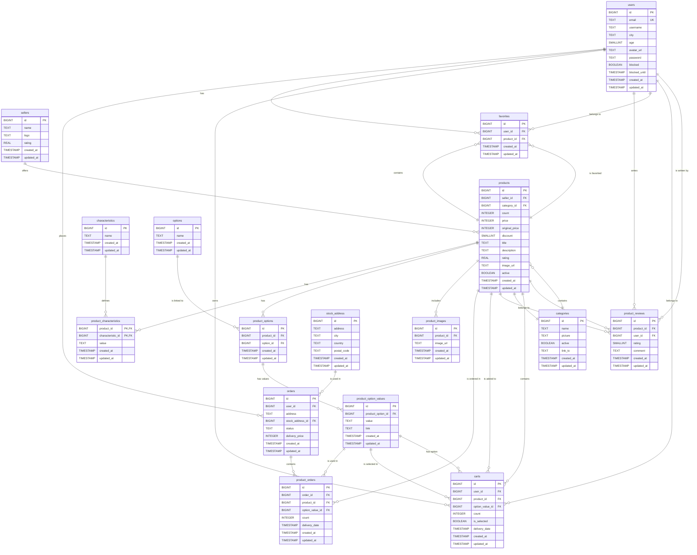

```mermaid
erDiagram

    %% Entity Definitions

    users {
        BIGINT id PK
        TEXT email UK
        TEXT username
        TEXT city
        SMALLINT age
        TEXT avatar_url
        TEXT password
        BOOLEAN blocked
        TIMESTAMP blocked_until
        TIMESTAMP created_at
        TIMESTAMP updated_at
    }

    sellers {
        BIGINT id PK
        TEXT name
        TEXT logo
        REAL rating
        TIMESTAMP created_at
        TIMESTAMP updated_at
    }

    categories {
        BIGINT id PK
        TEXT name
        TEXT picture
        BOOLEAN active
        TEXT link_to
        TIMESTAMP created_at
        TIMESTAMP updated_at
    }

    products {
        BIGINT id PK
        BIGINT seller_id FK
        BIGINT category_id FK
        INTEGER count
        INTEGER price
        INTEGER original_price
        SMALLINT discount
        TEXT title
        TEXT description
        REAL rating
        TEXT image_url
        BOOLEAN active
        TIMESTAMP created_at
        TIMESTAMP updated_at
    }

    characteristics {
        BIGINT id PK
        TEXT name
        TIMESTAMP created_at
        TIMESTAMP updated_at
    }

    product_characteristics {
        BIGINT product_id PK, FK
        BIGINT characteristic_id PK, FK
        TEXT value
        TIMESTAMP created_at
        TIMESTAMP updated_at
    }

    options {
        BIGINT id PK
        TEXT name
        TIMESTAMP created_at
        TIMESTAMP updated_at
    }

    product_options {
        BIGINT id PK
        BIGINT product_id FK
        BIGINT option_id FK
        TIMESTAMP created_at
        TIMESTAMP updated_at
    }

    product_option_values {
        BIGINT id PK
        BIGINT product_option_id FK
        TEXT value
        TEXT link
        TIMESTAMP created_at
        TIMESTAMP updated_at
    }

    favorites {
        BIGINT id PK
        BIGINT user_id FK
        BIGINT product_id FK
        TIMESTAMP created_at
        TIMESTAMP updated_at
    }

    product_images {
        BIGINT id PK
        BIGINT product_id FK
        TEXT image_url
        TIMESTAMP created_at
        TIMESTAMP updated_at
    }

    stock_address {
        BIGINT id PK
        TEXT address
        TEXT city
        TEXT country
        TEXT postal_code
        TIMESTAMP created_at
        TIMESTAMP updated_at
    }

    orders {
        BIGINT id PK
        BIGINT user_id FK
        TEXT address
        BIGINT stock_address_id FK
        TEXT status
        INTEGER delivery_price
        TIMESTAMP created_at
        TIMESTAMP updated_at
    }

    product_orders {
        BIGINT id PK
        BIGINT order_id FK
        BIGINT product_id FK
        BIGINT option_value_id FK
        INTEGER count
        TIMESTAMP delivery_date
        TIMESTAMP created_at
        TIMESTAMP updated_at
    }

    carts {
        BIGINT id PK
        BIGINT user_id FK
        BIGINT product_id FK
        BIGINT option_value_id FK
        INTEGER count
        BOOLEAN is_selected
        TIMESTAMP delivery_date
        TIMESTAMP created_at
        TIMESTAMP updated_at
    }

    product_reviews {
        BIGINT id PK
        BIGINT product_id FK
        BIGINT user_id FK
        SMALLINT rating
        TEXT comment
        TIMESTAMP created_at
        TIMESTAMP updated_at
    }

    %% Relationships

    users ||--o{ orders : "places"
    users ||--o{ favorites : "has"
    users ||--o{ carts : "owns"
    users ||--o{ product_reviews : "writes"

    sellers ||--o{ products : "offers"

    categories ||--o{ products : "contains"

    products ||--o{ product_characteristics : "has"
    products ||--o{ product_options : "has"
    products ||--o{ product_images : "includes"
    products ||--o{ product_orders : "is ordered in"
    products ||--o{ carts : "is added to"
    products ||--o{ favorites : "is favorited"
    products ||--o{ product_reviews : "has reviews"
    products ||--|| categories : "belongs to"

    characteristics ||--o{ product_characteristics : "defines"

    options ||--o{ product_options : "is linked to"

    product_options ||--o{ product_option_values : "has values"

    stock_address ||--o{ orders : "is used in"

    orders ||--o{ product_orders : "contains"

    product_option_values ||--o{ product_orders : "is used in"
    product_option_values ||--o{ carts : "is selected in"

    product_reviews }o--|| users : "is written by"
    product_reviews }o--|| products : "reviews"

    carts }o--|| users : "belongs to"
    carts }o--|| products : "contains"
    carts }o--|| product_option_values : "has option"

    favorites }o--|| users : "belongs to"
    favorites }o--|| products : "contains"
```
